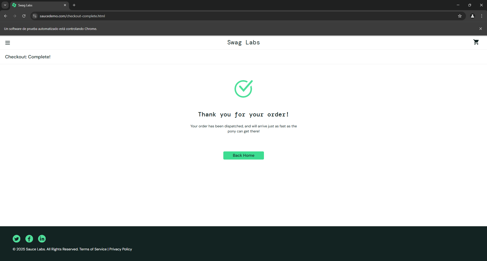

# TestFoundations
Por Juan Diego Vera Godoy

Para ejecutar este test es necesario jdk 21.0.5

en la ruta test\java\testCases esta el archivo PurchaseSauceDemoTest, se debe compilar el proyecto
posteriormente se debe ejecutar, se abrira la ventana, ejecutara todo el flujo y luego se cerrara.

